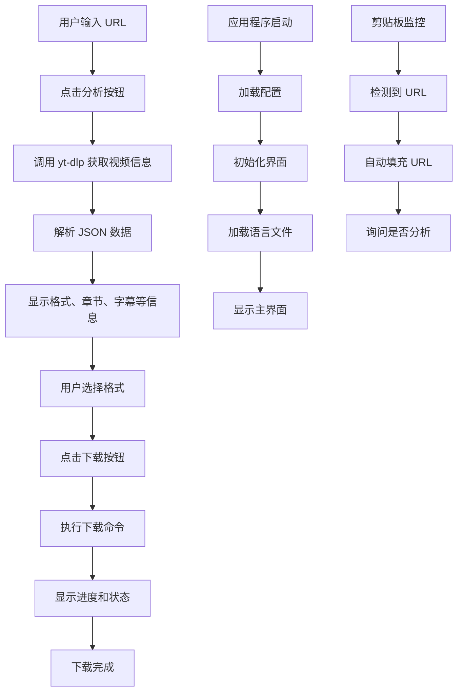
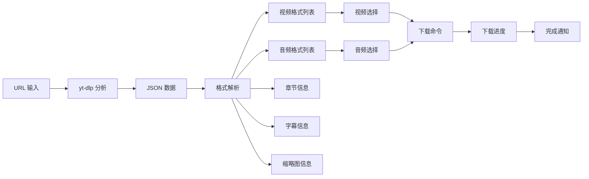

# yt-dlp-gui 项目详细分析文档

## 项目概述

yt-dlp-gui 是一个基于 WPF 的 Windows 桌面应用程序，作为 yt-dlp（以及兼容应用）的前端界面。它提供了一个易于使用的图形界面来下载视频和音频内容，支持多种功能如选择视频质量、下载单个章节、支持 Cookie、配置文件、外部下载器（Aria2）等。

## 项目结构

```
yt-dlp-gui/
├── .github/                    # GitHub 相关文件
│   ├── README.md              # 项目说明文档
│   ├── screenshot01.png       # 截图
│   └── workflows/             # CI/CD 工作流
├── languages/                 # 多语言支持文件夹
│   ├── ar-MA/                 # 阿拉伯语
│   ├── de-DE/                 # 德语
│   ├── el-GR/                 # 希腊语
│   ├── en-US/                 # 英语
│   ├── es-ES/                 # 西班牙语
│   ├── fr-FR/                 # 法语
│   ├── it-IT/                 # 意大利语
│   ├── ja-JP/                 # 日语
│   └── ...                    # 其他语言
├── yt-dlp-gui/                # 主要源代码目录
│   ├── App/                   # 应用程序路径相关类
│   │   └── App.Path.cs        # 应用程序路径管理
│   ├── Controls/              # 自定义控件
│   │   ├── ActualSize.cs      # 实际尺寸控制
│   │   ├── BrowserBehavior.cs # 浏览器行为
│   │   ├── Duration.cs        # 持续时间显示
│   │   ├── Filesize.cs        # 文件大小显示
│   │   ├── Icons.xaml         # 图标资源
│   │   ├── Icons.xaml.cs      # 图标逻辑
│   │   ├── Menu.xaml          # 菜单控件
│   │   ├── Menu.xaml.cs       # 菜单逻辑
│   │   ├── TextBoxNumber.cs   # 数字输入框
│   │   ├── TextEditor.xaml    # 文本编辑器
│   │   ├── TextEditor.xaml.cs # 文本编辑器逻辑
│   │   ├── TextView.xaml      # 文本视图
│   │   └── TextView.xaml.cs   # 文本视图逻辑
│   ├── Libs/                  # 库文件
│   │   ├── Util.Env.cs        # 环境工具
│   │   ├── Util.PropertyCopy.cs # 属性复制工具
│   │   ├── Util.Resources.cs  # 资源工具
│   │   ├── Util.Shell.cs      # Shell 工具
│   │   ├── Util.Tools.cs      # 通用工具
│   │   ├── Util.UrlValid.cs   # URL 验证工具
│   │   ├── Web.cs             # 网络操作
│   │   ├── Yaml.cs            # YAML 操作
│   │   └── YamlDescription.cs # YAML 描述
│   ├── Models/                # 数据模型
│   │   ├── Chapters.cs        # 章节模型
│   │   ├── Config.cs          # 配置模型
│   │   ├── Cookies.cs         # Cookie 模型
│   │   ├── Format.cs          # 格式模型
│   │   ├── Lang.cs            # 语言模型
│   │   ├── Subs.cs            # 字幕模型
│   │   ├── Thumb.cs           # 缩略图模型
│   │   ├── Video.cs           # 视频模型
│   │   └── VTask.cs           # 任务模型
│   ├── Resources/             # 资源文件
│   │   ├── xshd/              # 语法高亮定义
│   │   │   ├── desc.xshd      # 描述语法
│   │   │   └── url.xshd       # URL 语法
│   │   └── logo.ico           # 应用图标
│   ├── Themes/                # 主题样式
│   │   ├── CustomUI.xaml      # 自定义 UI 样式
│   │   ├── CustomUI.xaml.cs   # 自定义 UI 逻辑
│   │   ├── DarkTheme.xaml     # 暗色主题
│   │   └── DarkTheme.xaml.cs  # 暗色主题逻辑
│   ├── ViewModels/            # 视图模型
│   │   └── Main.cs            # 主窗口视图模型
│   ├── Views/                 # 视图
│   │   ├── About.xaml         # 关于页面
│   │   ├── About.xaml.cs      # 关于页面逻辑
│   │   ├── Main.xaml          # 主页面
│   │   ├── Main.xaml.cs       # 主页面逻辑
│   │   ├── Release.xaml       # 发布页面
│   │   └── Release.xaml.cs    # 发布页面逻辑
│   ├── Wrappers/              # 包装器
│   │   ├── DLP.cs             # yt-dlp 包装器
│   │   └── FFMPEG.cs          # FFmpeg 包装器
│   ├── App.xaml               # 应用程序入口 XAML
│   ├── App.xaml.cs            # 应用程序入口逻辑
│   ├── AssemblyInfo.cs        # 程序集信息
│   ├── FodyWeavers.xml        # Fody 配置
│   └── yt-dlp-gui.csproj      # 项目文件
├── .gitattributes             # Git 属性配置
├── .gitignore                 # Git 忽略配置
├── LICENSE.txt                # 许可证
├── PenBo整理文档.md           # 开发说明文档
├── yt-dlp-gui.sln             # 解决方案文件
```

## 项目文件详细分析

### 1. 项目配置文件

#### 1.1 解决方案文件 (yt-dlp-gui.sln)
- 定义了 Visual Studio 解决方案的基本信息
- 包含一个项目：yt-dlp-gui
- 支持 Debug 和 Release 配置
- 使用 Visual Studio 2022 (版本 17)

#### 1.2 项目文件 (yt-dlp-gui/yt-dlp-gui.csproj)
- 目标框架：.NET 6.0 Windows 10.0.17763.0
- 输出类型：WinExe (Windows 可执行文件)
- 使用 WPF 框架
- 包含多个 NuGet 包引用：
  - AvalonEdit: 代码编辑器控件
  - Markdig: Markdown 解析器
  - MdXaml_migfree: Markdown 显示控件
  - Microsoft.Toolkit.Uwp.Notifications: 通知系统
  - Microsoft.Xaml.Behaviors.Wpf: XAML 行为
  - Newtonsoft.Json: JSON 操作
  - PropertyChanged.Fody: 属性变更通知
  - SharpClipboard: 剪贴板操作
  - Swordfish.NET.CollectionsV3: 并发集合
  - System.Resources.ResourceManager: 资源管理
  - YamlDotNet: YAML 操作

#### 1.3 FodyWeavers.xml
- 配置了 PropertyChanged.Fody 织入器
- 用于自动生成属性变更通知代码

### 2. 应用程序入口

#### 2.1 App.xaml
- 定义应用程序资源
- 设置启动事件处理程序
- 引用暗色主题和自定义 UI 样式

#### 2.2 App.xaml.cs
- 定义全局静态变量如当前版本、语言设置
- 在启动时加载路径信息和语言配置
- 显示主窗口

#### 2.3 App.Path.cs
- 管理应用程序路径相关功能
- 提供枚举 Folders 定义不同类型的文件夹（根目录、二进制文件、配置、临时）
- 提供方法构建路径

### 3. 控件 (Controls)

#### 3.1 Icons.xaml/.cs
- 自定义图标控件
- 支持多种内置图标（播放、下载、菜单等）
- 支持旋转动画效果

#### 3.2 TextEditor.xaml/.cs
- 基于 AvalonEdit 的文本编辑器控件
- 支持语法高亮（URL、描述等）
- 可以设置帮助文本

#### 3.3 Menu.xaml/.cs
- 自定义菜单控件
- 提供动态菜单项创建功能

#### 3.4 其他控件
- ActualSize.cs: 获取实际尺寸
- Duration.cs: 持续时间格式化
- Filesize.cs: 文件大小格式化
- TextBoxNumber.cs: 数字输入验证

### 4. 模型 (Models)

#### 4.1 Video.cs
- 视频数据模型
- 包含 ID、标题、格式列表、缩略图、字幕、描述、持续时间等属性
- 支持属性变更通知

#### 4.2 Format.cs
- 格式数据模型
- 包含音频采样率、文件大小、格式 ID、分辨率、编解码器等属性
- 定义了格式类型枚举（视频、音频、包、其他）
- 包含音频和视频格式比较器

#### 4.3 Lang.cs
- 语言本地化模型
- 包含应用程序名称、主界面、关于界面、发布界面、对话框、文件类型、状态信息等多语言字符串
- 支持属性变更通知

#### 4.4 其他模型
- Chapters.cs: 章节模型
- Config.cs: 配置模型
- Cookies.cs: Cookie 模型
- Subs.cs: 字幕模型
- Thumb.cs: 缩略图模型
- VTask.cs: 任务模型

### 5. 视图 (Views)

#### 5.1 Main.xaml/.cs
- 主界面窗口
- 包含标签页：主界面、高级、选项
- 提供 URL 输入、分析按钮、视频/音频格式选择、下载等功能
- 实现了完整的下载流程逻辑

#### 5.2 About.xaml/.cs
- 关于界面
- 显示应用程序信息、作者、网站等

#### 5.3 Release.xaml/.cs
- 发布界面
- 显示版本更新信息

### 6. 视图模型 (ViewModels)

#### 6.1 Main.cs
- 主窗口的视图模型
- 包含大量属性用于绑定界面元素
- 实现了下载状态报告、格式选择逻辑等

### 7. 包装器 (Wrappers)

#### 7.1 DLP.cs
- yt-dlp 命令行工具的包装器
- 封装了各种命令行参数和选项
- 提供下载、分析、格式选择等功能

#### 7.2 FFMPEG.cs
- FFmpeg 命令行工具的包装器
- 提供合并、分割、下载等功能

### 8. 库文件 (Libs)

#### 8.1 各种工具类
- Util.Env.cs: 环境变量处理
- Util.PropertyCopy.cs: 属性复制
- Util.Resources.cs: 资源操作
- Util.Shell.cs: Shell 操作
- Util.Tools.cs: 通用工具函数
- Util.UrlValid.cs: URL 验证

#### 8.2 Web.cs
- 网络操作封装
- 提供 HTTP 请求、文件下载、头部检查等功能

#### 8.3 Yaml.cs
- YAML 文件操作封装
- 提供序列化和反序列化功能

### 9. 主题 (Themes)

#### 9.1 DarkTheme.xaml
- 暗色主题样式定义
- 包含各种控件的颜色和样式定义

#### 9.2 CustomUI.xaml
- 自定义用户界面样式
- 包含组合框模板、菜单样式等

### 10. 资源 (Resources)

#### 10.1 xshd 目录
- 语法高亮定义文件
- desc.xshd: 描述文本语法
- url.xshd: URL 语法

#### 10.2 logo.ico
- 应用程序图标

### 11. 多语言支持 (languages)

#### 11.1 语言文件结构
- 每种语言一个子目录
- 使用 YAML 格式存储翻译字符串
- 支持多种语言（英语、德语、希腊语、西班牙语、法语、意大利语、日语、韩语、波兰语、葡萄牙语、俄语、乌克兰语、中文等）

## 核心功能流程

### 1. 下载流程
1. 用户输入 URL
2. 点击"分析"按钮
3. 应用程序调用 yt-dlp 获取视频信息
4. 解析返回的 JSON 数据
5. 显示可用格式、章节、字幕等信息
6. 用户选择视频和音频格式
7. 点击"下载"按钮
8. 执行下载命令
9. 显示进度和状态

### 2. 本地化流程
1. 应用程序启动时检测语言设置
2. 加载相应的语言文件
3. 将界面元素绑定到语言模型
4. 动态更新界面文本

### 3. 配置管理
1. 从 YAML 文件加载配置
2. 应用配置到界面元素
3. 监听配置变更并自动保存

## 技术架构

### 1. MVVM 架构
- Model: 数据模型（Models 目录）
- View: 用户界面（Views 目录）
- ViewModel: 视图模型（ViewModels 目录）

### 2. 依赖注入
- 使用 WPF 的数据绑定机制
- 通过 DataContext 连接视图和视图模型

### 3. 异步编程
- 使用 Task 和异步方法处理长时间运行的操作
- 避免界面冻结

### 4. 多线程安全
- 使用并发集合确保线程安全
- 在 UI 线程上更新界面元素

## 依赖项

### 1. 第三方库
- AvalonEdit: 代码编辑器
- Newtonsoft.Json: JSON 处理
- YamlDotNet: YAML 处理
- SharpClipboard: 剪贴板监控
- Swordfish.NET.Collections: 并发集合

### 2. 外部工具
- yt-dlp: 视频下载工具
- FFmpeg: 媒体处理工具
- Aria2: 外部下载器

## 设计模式

### 1. 观察者模式
- 通过 INotifyPropertyChanged 接口实现属性变更通知

### 2. 命令模式
- 使用 WPF 命令处理用户交互

### 3. 适配器模式
- 通过包装器类封装外部工具

## 项目特点

### 1. 便携性
- 单文件部署
- 无需安装
- 配置文件存储在本地

### 2. 多语言支持
- 支持多种语言
- 易于扩展新的语言

### 3. 现代 UI
- 暗色主题
- 响应式设计
- 直观的操作界面

### 4. 功能丰富
- 支持多种视频平台
- 可选择视频质量
- 支持 Cookie 和配置文件
- 外部下载器支持

## 系统架构流程图



## 数据流图



## 类关系图

```mermaid
classDiagram
    class App {
        +string CurrentVersion
        +Lang Lang
        +string AppExe
        +string AppPath
        +string AppName
        +Path(Folders type, string[] pathpart)
    }
    
    class Video {
        +string id
        +string title
        +List~Format~ formats
        +List~Thumb~ thumbnails
        +Dictionary~string, List~Subs~~ subtitles
        +string thumbnail
        +string description
        +decimal duration
    }
    
    class Format {
        +decimal? asr
        +long? filesize
        +string format_id
        +decimal? fps
        +decimal? height
        +decimal? width
        +FormatType type
        +string resolution
    }
    
    class DLP {
        +string Path_DLP
        +string Path_Aria2
        +string Path_FFMPEG
        +List~string~ Files
        +Dictionary~string, string~ Options
        +string Url
        +DLP LoadConfig(string path)
        +DLP Output(string targetpath)
        +DLP DownloadFormat(string format_id, string targetpath, string originext)
        +Process Exec(Action~string~ stdall, Action~string~ stdout, Action~string~ stderr)
    }
    
    class MainViewData {
        +Video? Video
        +ConcurrentObservableCollection~Format~ Formats
        +Format selectedVideo
        +Format selectedAudio
        +string Url
        +string TargetPath
        +string TargetName
        +bool IsAnalyze
        +bool IsDownload
    }
    
    App ||--|| Video : 使用
    Video ||--o{ Format : 包含
    MainViewData ||--|| Video : 包含
    MainViewData ||--o{ Format : 包含
    DLP ..> Format : 操作
```

## 总结

yt-dlp-gui 是一个功能丰富的视频下载前端应用程序，采用现代 WPF 技术栈开发。项目结构清晰，模块化程度高，具有良好的可维护性和扩展性。通过 MVVM 架构实现了界面与业务逻辑的分离，使用多种设计模式提高了代码的可重用性。项目支持多语言、多平台，并提供了丰富的功能选项，是一个成熟稳定的桌面应用程序。